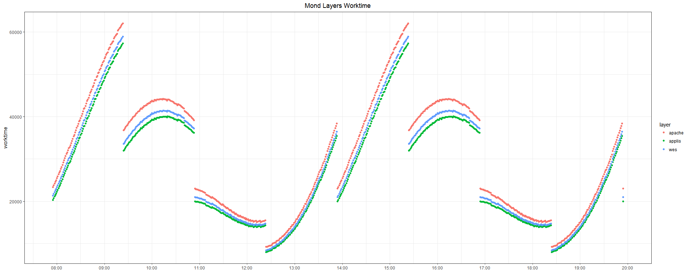

```{r setup, include=FALSE}
library(knitr)
library(kableExtra)
library(gridExtra)
knitr::opts_chunk$set(echo = TRUE)
knitr::opts_knit$set(warnings=FALSE)
knitr::opts_knit$set(message=FALSE)
setwd("D:/jisnard/Documents/spoud/")
source("helpers.R")
load("applis_bucket.RData")
load("analysisworkspace.RData")
load("worktime_forecast.RData")
```

Note : supporting code and plots are available at github.com/chadmulligan/spoud

## Intro - Preprocessing the data

The purpose of this analysis is to set the basis of a dashboard for software applicaitons maintenance that would help monitor the 3 layers so as to :

  * warn IT of software applicaitons unexpected behaviour as funtion of response time, throughput / worktime.
  * identify the faulty component/layer
  * take action
  
  

#### Issue 

The data response time data is extracted as a JSON file with wrong formatting. 
  
  

#### Consequence 

At the moment, preprocessing the data requires parsing the whole JSON files before processing them.

  * time inefficent
  * resource expensive
  
  

#### Solution

What we have: 

    {
        "beatType": "ServiceProviderBeat",
        "beatId": 0,
        "eventTime": "2018-05-05T07:55:38.422185+00:00",
        "correlationId": "6ee2fa2b-a1ca-405e-9088-94dbb834730f",
        "callId": 0,
        "appIdProvider": "sim-provider",
        "appIdConsumer": "spoud-app",
        "fkNameProvider": "fkNameProvider",
        "fkNameConsumer": "portal",
        "tkNameIdProvider": "tm4-Mond-52",
        "tkNameIdConsumer": "spoud-portal",
        "hostName": "tm4-foo",
        etc.
    }
    {
        "beatType": "ServiceProviderBeat",
        "beatId": 2,
        "eventTime": "2018-05-05T07:55:38.432086+00:00",
        "correlationId": "7aa2e01f-4af6-48e8-ae98-a42fe9fc6e5d",
        "callId": 2,
        "appIdProvider": "sim-provider",
        "appIdConsumer": "spoud-app",
        "fkNameProvider": "fkNameProvider",
        "fkNameConsumer": "portal",
        "tkNameIdProvider": "tm4-Mond-52",
        "tkNameIdConsumer": "spoud-portal",
        "hostName": "tm4-foo",
        etc.
    }
  
  
What we need: 

      [
      {
          "beatType": "ServiceProviderBeat",
          "beatId": 0,
          "eventTime": "2018-05-05T07:55:38.422185+00:00",
          "correlationId": "6ee2fa2b-a1ca-405e-9088-94dbb834730f",
          "callId": 0,
          "appIdProvider": "sim-provider",
          "appIdConsumer": "spoud-app",
          "fkNameProvider": "fkNameProvider",
          "fkNameConsumer": "portal",
          "tkNameIdProvider": "tm4-Mond-52",
          "tkNameIdConsumer": "spoud-portal",
          "hostName": "tm4-foo",
          etc.
      },
      {
          "beatType": "ServiceProviderBeat",
          "beatId": 2,
          "eventTime": "2018-05-05T07:55:38.432086+00:00",
          "correlationId": "7aa2e01f-4af6-48e8-ae98-a42fe9fc6e5d",
          "callId": 2,
          "appIdProvider": "sim-provider",
          "appIdConsumer": "spoud-app",
          "fkNameProvider": "fkNameProvider",
          "fkNameConsumer": "portal",
          "tkNameIdProvider": "tm4-Mond-52",
          "tkNameIdConsumer": "spoud-portal",
          "hostName": "tm4-foo",
          etc. 
      }
      ]

\
\


## Visualizations of the applications layer

We have 12 hours of data over the 3 layers for a set o 18 technical components. Data was aggregated in 1-minute buckets ; We show the throughput (number of calls per 1 minute), average response time, and worktime to identify regular and faulty component behaviour on a given layer. 

\
\


#### Throughput

Plotted by technical component (tkNameIdProvider), and ordered by incoming period for clarity. 


```{r, fig.height=8, fig.width=10, fig.align='center'}

###ordering the throughput graph
maxes <- data.frame(tkNameIdProvider = rep(NA, 18), eventTime = rep(NA, 18))
for (i in 1:18) {
  level <- levels(applis_bucket$tkNameIdProvider)[i]
  maxes$tkNameIdProvider[i] <- paste(applis_bucket[applis_bucket$tkNameIdProvider==level & applis_bucket$throughput == 160, c("tkNameIdProvider")][[1]])
  maxes$eventTime[i] <- paste(applis_bucket[applis_bucket$tkNameIdProvider==level & applis_bucket$throughput == 160, c("eventTime")][[1]])
  }

maxes [,2] <- ymd_hms(maxes[,2])

ordered_levels <- maxes %>%
  arrange(eventTime) %>%
  pull(tkNameIdProvider)


###Plotting Throughput
applis_bucket$newfac <- factor(applis_bucket$tkNameIdProvider, levels = ordered_levels)

g1 <- ggplot(applis_bucket, aes(x=eventTime, 
                                y=throughput, group =tkNameIdProvider, col=newfac)) +
  
  geom_point() + 
  facet_grid(newfac ~ . ) +
  theme_bw() +
  ggtitle("Throughput") +
  theme(plot.title = element_text(hjust = 0.5)) +
  scale_x_datetime(date_breaks = "1 hour",
                   labels = date_format("%H:%M")) +
  theme(axis.title.y = element_blank(),
        axis.title.x = element_blank()) +
  guides(col=guide_legend(title = element_blank()))

g1

```

\
\


##### Throuput features: 

```{r, echo=FALSE,}
applis_bucket %>%
  group_by(tkNameIdProvider) %>%
  summarise(min = min(throughput), max = max(throughput)) %>%
  as.data.frame() %>%
  kable("html") %>%
  kable_styling(bootstrap_options = "striped", position = "left",full_width = F)

```

With periods of roughly 5h30min - peaking during 15 minutes. 

\
\


#### Average response Time


```{r, echo=FALSE, fig.height=8, fig.width=10, fig.align='center'}
g2 <- ggplot(applis_bucket, aes(x=eventTime, y=avg_respTime, group = tkNameIdProvider, col=newfac)) +
  geom_point() + 
  facet_grid(newfac ~ .) +
  theme_bw() +
  ggtitle("Average Response Time") +
  theme(plot.title = element_text(hjust = 0.5)) +
  scale_x_datetime(date_breaks = "1 hour",
                   labels = date_format("%H:%M")) +
  theme(axis.title.y = element_blank(),
        axis.title.x = element_blank()) +
  guides(col=guide_legend(title = element_blank())) 

g2
```

\

Obviously, the Ganymed technical component failed at 12h30. 

\
\


##### Average response Time Features

```{r, echo=FALSE,}
applis_bucket %>%
  group_by(tkNameIdProvider) %>%
  summarise(min = min(avg_respTime), max = max(avg_respTime)) %>%
  as.data.frame() %>%
  kable("html") %>%
  kable_styling(bootstrap_options = "striped", position = "left",full_width = F)

```

Average response time are in sawtooth waves, with a 90 minutes-period. 

\
\


#### Worktime

```{r, echo=FALSE, fig.height=8, fig.width=10, fig.align='center'}
g3 <- ggplot(applis_bucket, aes(x=eventTime, y=worktime, group = tkNameIdProvider, col=newfac)) +
  geom_point() + 
  facet_grid(newfac ~ . ) +
  theme_bw() +
  ggtitle("Worktime") +
  theme(plot.title = element_text(hjust = 0.5)) +
  scale_x_datetime(date_breaks = "1 hour",
                   labels = date_format("%H:%M")) +
  theme(axis.title.y = element_blank(),
        axis.title.x = element_blank()) +
  guides(col=guide_legend(title = element_blank())) 

g3
```

\
\


## Time Series Forecasting


We selected the "Mond" technical component to model a regular behaviour.  As worktime = Average Response Time * Throughput we only modeled and forecasted throughput and Average response time and derived Worktime forecasts from the results. 

```{r echo=FALSE, fig.height=5, fig.width=10, fig.align='center'}
g4 <- ggplot(applis_mond_bucket, aes(x=eventTime, y=throughput)) +
  geom_point() + 
  theme_bw() +
  ggtitle("Mond - Throughput") +
  theme(plot.title = element_text(hjust = 0.5)) +
  scale_x_datetime(date_breaks = "1 hour",
                   labels = date_format("%H:%M")) +
  theme(axis.title.y = element_blank(),
        axis.title.x = element_blank()) +
  guides(col=guide_legend(title = element_blank())) 


g5 <- ggplot(applis_mond_bucket, aes(x=eventTime, y=avg_respTime)) +
  geom_point() + 
  theme_bw() +
  ggtitle("Mond - Average response Time") +
  theme(plot.title = element_text(hjust = 0.5)) +
  scale_x_datetime(date_breaks = "1 hour",
                   labels = date_format("%H:%M")) +
  theme(axis.title.y = element_blank(),
        axis.title.x = element_blank()) +
  guides(col=guide_legend(title = element_blank())) 


grid.arrange(g4, g5, ncol=2)
```

\


### Estimating Throughput

Facing a periodic signal we fit a model using a Seasonal Decomposition of Time Series by Loess (STL) that will gives us a rough fit of the curve (it takes a window of the observaitons and fit a curve locally to extract seasonal and trend components) and model the uncaught remainder with a standard ARIMA. 

\


#### Decomposition

```{r, echo=FALSE, fig.height=8, fig.width=10, fig.align='center'}
ts.throughput %>%
 stl(s.window=13) %>%
  autoplot()

```

\


#### Automatic AR model

We separated the dataset in a train and a test set, with a 60% / 40% ratio. We start by fitting an STL + autoregressive model (the observations are a linear combination of former observations). The function applies a non-seasonal forecasting method to the sea-
sonally adjusted data and re-seasonalize using the last the seasonal window component  (forecast R package).  

```{r, echo=FALSE, fig.height=8, fig.width=10, fig.align='center'}
fit.ts <- stlm(y = ts.throughput.train, modelfunction = ar) 
forecast.ts <- forecast(object=fit.ts, h = length(ts.throughput.test))
autoplot(forecast.ts) + autolayer(ts.throughput.test, series = "Mond (test)")

```

\

The model is far from optimal. We compute the accuracy of the forecast compared to the test set using the mean absolute percentage error (MAPE) computed as such: 

    mean(|pi|)
    
    pi=100 * yi−y^i/yi, y^i a forecast of yi

\


Applied to our model : 

```{r, echo=FALSE}
cat(paste0("MAPE: ", accuracy(forecast.ts, ts.throughput.test)["Test set", "MAPE"]))

```

\


#### Tuning an ARIMA

Hence, we decide to tune the model by forcing it to try a wider range of parameters on a generalized ARIMA model that adds a differencing and a moving average (lagged white noise error terms) components. We test the following set of parameters: 

  * ar : between 0 and 25
  * diff : 0 or 1
  * ma : 0 or 1
  * 104 models in total

\


We compute each model, calculate the accuracy on the test set, and then choose the best performing model from our set. 

````{r, eval = FALSE}
###the training function 
stl.train <- function(grid = data.frame(), train = ts(), test = ts()){
  
  test.length <- length(test)
  
  for (i in 1:nrow(grid)){
    
    fit <- NULL
    forecast.fit <- NULL
    
    ###select a model in our model grid
    order.grid <- c(grid[i, 1], grid[i, 2], grid[i, 3])
    
    ###feeding it to the model function
    arima.mod <- function(x, ...) {return(arima(x, order= order.grid, ...))}
    
    ###fitting the model and computing the accuracy
    tryCatch({
      fit <- stlm(y = train, modelfunction = arima.mod) 
      forecast.fit <- forecast(object=fit, h = test.length)
      grid$mape[i] <- accuracy(forecast.ts, test)["Test set", "MAPE"]
    },
    error=function(e) {cat("ERROR :",conditionMessage(e), "\n")},
    warning=function(w) {cat("WARNING :",conditionMessage(w), "\n")}
    )
  }

  ###returning the grid augmented with accuracy
  grid
  
}

###training the model 
results <- stl.train(grid, ts.throughput.train, ts.throughput.test)

````

\


The best performing model: 

`````{r, echo = FALSE}
#### Selecting the best performing
results %>%
  arrange(accuracy) %>%
  slice(1) %>%
  as.data.frame() %>%
  kable("html") %>%
  kable_styling(bootstrap_options = "striped", position = "left",full_width = F)

````


\

Our best model is an STL + ARIMA (15, 0, 1), hence including 15 minutes lag + 1 lagged white noise error term. 


````{r, fig.height=8, fig.width=10, fig.align='center'}
###refitting and ploting the forecasts of the selected model
arima.mod <- function(x , ...) {return(stats::arima(x, order= c(15, 0, 1), ...))}

fit.ts <- stlm(y = ts.throughput.train, modelfunction = arima.mod) 
forecast.ts <- forecast(object=fit.ts, h = length(ts.throughput.test))
autoplot(forecast.ts) + autolayer(ts.throughput.test, series = "Mond (test)")

````

\


#### Discussion

As we said, the curve is a weel-defined periodic signal. Next task should be to find the actual curve equation through fourier decomposition. We tried to tune an ARIMA model using external Fourier regressors but it was taking too much time. We cannot get a zero-percentage error model though, due to the smoothing effect vs. discrete observations. 

Another issue is that the STL decoposition is sensibile to the train set, added to the fact that our training set spans a single period. At least, the model should be fitted on 2-3 periods to be ensure stability and reproducibility. Best option would be to train the models on a rolling window time series so as to know exactly how many periods should be taken into account. Also, we could try testing a model that would forecast throughput x-minutes away to alert from incoming surges, but the capped number of calls makes it unnecessary for now.  

\


### Average Response Time

The sawtooth wave form of the observations prevent us from using our former approach as training does not improve the accuracy. 

A glance at the automatic STL + ARIMA model forecast (untrained): 

```{r, echo=FALSE, fig.align='center'}

autoplot(forecast.avg.ts) + autolayer(ts.avgresp.test, series = "Mond (test)")

```


Model accuracy: 

```{r, echo=FALSE, fig.align='center'}

cat(paste0("MAPE: ", accuracy(forecast.avg.ts, ts.avgresp.test)["Test set", "MAPE"]))

```

\


Considering the regularity of the wave, having the exact same minimum, maximum, and period, we have simply rewritten the wave equation into a wrapper that can build the wave from any given point for the desired length.

Hence, the equation form of our average response time model is:

  * average response time = minimum average response time + slope * minutes since the minimum, on a 90-minute window.  


```{r, eval=FALSE}
##### THE OTHER METHOD #####

###m getting the period parameter for this specific component 
maxes <- which(max(ts.avgresp.train) == ts.avgresp.train)
diff(maxes)

### getting the intercept and slope terms
min.avg <- min(ts.avgresp.train)
slope <- (max(ts.avgresp.train) - min(ts.avgresp.train))/diff(maxes)[1]

###the "forecasting" function 
forecast_avg_resptime <- function(ts.train=ts.avgresp.train, h=length(ts.avgresp.test), 
                                  period = diff(maxes)[1], 
                                  ts.slope=slope, ts.min.avg=min.avg) {
  
  #finding from which minute in the 90-minute window the wave should start
  position <- round((ts.train[length(ts.train)] - ts.min.avg) / ts.slope)
  
  periods <- c()
  
  #fill until the 90-min max
  periods[1:(period - position)] <- c((position+1):period)
  
  #fill the full periods and the remainder
  fullperiods <- (h - (period - position)) %/% period
  remainder <- (h - (period - position)) %% period
  
  if(fullperiods != 0) {periods <- c(periods, rep(1:period, fullperiods))}
  
  if(remainder != 0) {periods <- c(periods, 1:remainder)}
  
  ##return the "forecast" 
  forecast_avg.ts <- ts(sapply(periods, function(x){x <- round(ts.min.avg + ts.slope * x)}), freq = 60, start = length(ts.train)/60+1)
  
  forecast_avg.ts
  
}

###Results 
forecast_avg.ts <- forecast_avg_resptime()

```

\

This yields the following forecast: 

```{r, fig.height=8, fig.width=10, echo=FALSE, fig.align='center'}

autoplot(ts.avgresp.train) + autolayer(forecast_avg.ts) + autolayer(ts.avgresp.test)

```

\

We have a known error due to rounding and a slight intercept shifting. Fine tuning the wrapping funciton, or getting the actual parameters of the specific sawtooth wave function should give us an even closer forecast.  

```{r, echo=FALSE, fig.align='center'}

cat(paste0("MAPE: ", accuracy(forecast_avg.ts, ts.avgresp.test)["Test set", "MAPE"]))

```
\


### Worktime Estimation

Combining the results from our Throughput and Average Response Time models, we can derive a forecast for the Mond applicaiton worktime. 

```{r, fig.height=8, fig.width=10, echo=FALSE, fig.align='center'}

autoplot(forecast.worktime) + autolayer(ts.worktime.test)

```

The model accuracy: 

```{r, echo=FALSE}

cat(paste0("MAPE: ", accuracy(forecast.worktime, ts.worktime.test)["Test set", "MAPE"]))

```

\
\

## Correlating the Layers

At first we tried to plot the 3 layers on a single graph correlating them using matching parts in the following keys:

  * Applications: tkNameIdProvider (ex.: tm4-Mond-52)
  * WES : servername (ex.: tm4-Mond-0601)
  * Apache : meta_host (ex.: tm4-Mond-0602)


But we received the following tip: "Ah, that approach may not work because each event sequence has a causal order and I don’t know if this is respected at the level of the severname and meta_host", which would mean that only agregating per name could lead to selecting improper observations. 

We tested the datasets to check whether discrepancies exist between the correlationID and the technical component name :


```{r, eval=FALSE}
### getting the only component name in the 3 datasets
components_apache <- gsub("^[^-]*-([^.]+).*", "\\1", apache$meta_host)
components_apache <- gsub("(^[^-]*)-.*", "\\1", components_apache)


components_applis <- gsub("^[^-]*-([^.]+).*", "\\1", applis$tkNameIdProvider)
components_applis <- gsub("(^[^-]*)-.*", "\\1", components_applis)

components_wes <- gsub("^[^-]*-([^.]+).*", "\\1", wes$servername)
components_wes <- gsub("(^[^-]*)-.*", "\\1", components_wes)

```

\


\


\


\


This means that for these particular datasets we could have correlated the layers through the matching part of their names as the rows match across the datasets. For robustness and reusability, we nevertheless corrrelate the layers through correlation IDs as such: 


```{r, eval=FALSE}
##getting the correlation IDs for the Mond technical component in applis
applis_mond <- applis %>%
  filter(tkNameIdProvider == "tm4-Mond-52") %>%
  as.data.frame()

mond_corrID <- applis_mond$correlationId

###subsetting the wes and apache layers based on these components
wes_mond <- wes[wes$corrID %in% mond_corrID, ]
apache_mond <- apache[apache$corrID %in% mond_corrID, ]

```

\


We plot the Mond component worktime across the three layers. 




\


If considering that worktime increases as we go down the layers, the applications layer weirdly has  the smallest worktime of the three, consistently. 

